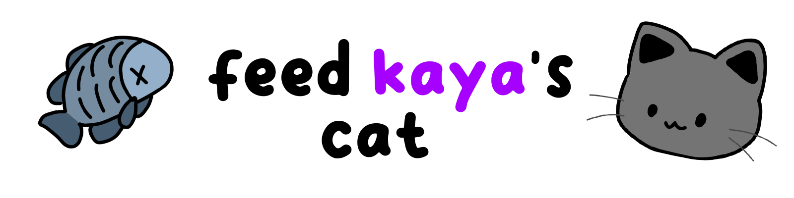

# Feed Kaya's Cat!


## Project Description
Feed Kaya's Cat! is a small game that helped me understand Python a bit better during summer using the `pygame` library.

## Features (0.1A)
- Drag-and-drop style game
- Some hats & different types of food
- Cute cat

## Installation
To install and run the project locally, follow these steps:

1. Clone the repository:
    ```sh
    git clone https://github.com/krovskiy/feed-kayas-cat.git
    ```
2. Install the requirements:
   ```bash
   pip install -r requirements.txt
3. Run the program:
   ```bash
   python main.py

## Gameplay


## Usage
1. Open the game using the executable file:
    - Extract the .zip file using a file archiver like 7-zip
    - Open the game using the .exe file
2. Run the game using the following command inside the folder:
    ```sh
    python main.py
    ```

## Future plans 
- Add minigames
- More items (Hats, Foods and even Backgrounds!)
- Implement different ways to interact with the cat
- Create more songs
- Add a night mode 

## Authors

dima - [everything except the bong sound effect lol](https://dima21.bandcamp.com/)

## Special thanks to 

[kaya](https://tired.moe/)

## License

AGPL-3.0 license

